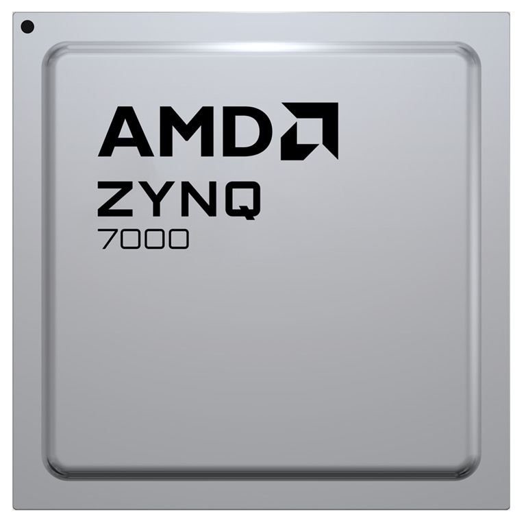
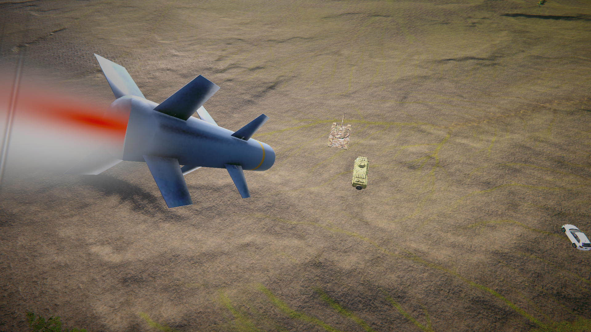
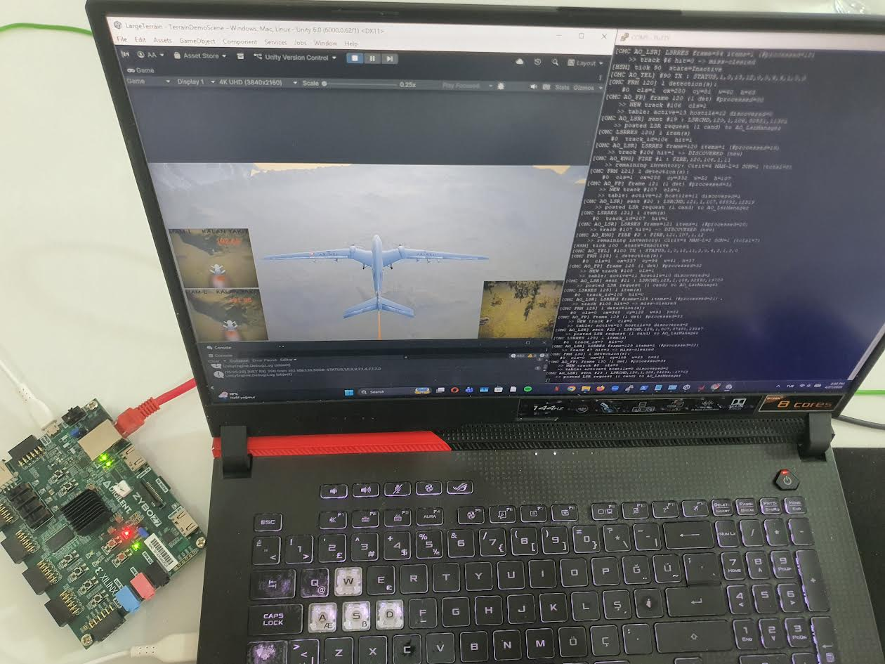
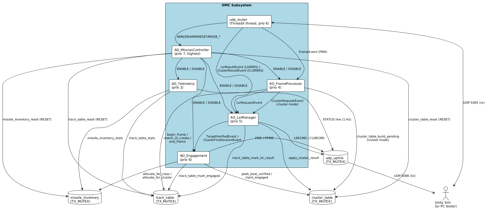
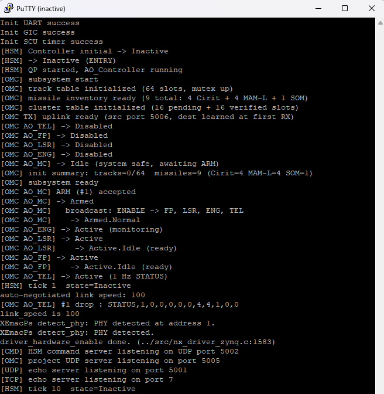
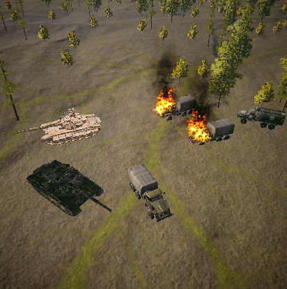

# zynq-vision-fire-control

> A real-time, defense-grade vision-guided **Onboard Mission Computer (OMC)** for an unmanned combat aerial vehicle (Akıncı-class UCAV), built from scratch on a **Xilinx Zynq-7000 (Zybo Z7-20)**. The board carries a custom integration of **Eclipse ThreadX**, **NetX Duo over 100 Mbps Ethernet**, and **QP/C 8.1.4 hierarchical state machines (HSMs)**. It closes the kill chain — detection → MOT tracking → laser verification → class-aware fire decision — for a **custom-trained YOLO v3-tiny** detector running in real time inside a **Unity 6000.x** simulator that physically launches missile prefabs and renders detonation effects.

[](https://github.com/eclipse-threadx/threadx)
[](https://github.com/eclipse-threadx/netxduo)
[](https://www.state-machine.com/products/qpc)
[](https://github.com/ultralytics/yolov3)
[](https://unity.com/)
[](https://www.xilinx.com/products/silicon-devices/soc/zynq-7000.html)
[](https://www.xilinx.com/products/design-tools/vitis.html)
[](https://en.wikipedia.org/wiki/C%2B%2B)

<p align="center">
  
  &nbsp;&nbsp;&nbsp;
  
  &nbsp;&nbsp;&nbsp;
  
  &nbsp;&nbsp;&nbsp;
  
  &nbsp;&nbsp;&nbsp;
  
  &nbsp;&nbsp;&nbsp;
  
</p>

<p align="center">
  
</p>

## Live demo

[](https://www.youtube.com/watch?v=hgIOaLgsaew)

GitHub does not embed video — the thumbnail above is clickable. Direct link: <https://www.youtube.com/watch?v=hgIOaLgsaew>

## Engineering report

A full engineering report (architecture, design trade-offs, MOT and clustering math, defense-grade alignment, operational scenarios with real UART traces, verification matrix) is included in the repository:

**→ [`docs/engineering_report.pdf`](docs/engineering_report.pdf)**

---

## Highlights

- **Three industrial-grade real-time runtimes integrated from scratch on bare-metal Cortex-A9** — Eclipse ThreadX (RTOS), NetX Duo (TCP/IP over Ethernet), and QP/C 8.1.4 (Active Object + HSM) — coexisting as one coherent stack.
- **6 Active Objects, each with its own HSM**, every shared service guarded by a **`TX_MUTEX` with priority inheritance** (`TX_INHERIT`).
- **100 Mbps Ethernet end-to-end** with sub-millisecond ICMP RTT; five concurrent UDP/TCP services on the same link, plus ICMP.
- **Custom-trained YOLO v3-tiny** on a hybrid (synthetic + open-source) ~10 000-image dataset for four classes — Tank, ZPT, MilitaryTruck, Civilian — reaching **mAP@0.5 = 0.995**.
- **Defense-grade discipline:** static memory only (no `malloc` / `new`), fully interrupt-driven I/O, fail-soft graceful degradation, libm-free numerics.
- **Cluster mode added as a strict superset** — DBSCAN-style grouping plus a score-aware munition table; the single-target code path is byte-for-byte unchanged.

---

## Technology stack

| Layer | Technology | Role |
| --- | --- | --- |
| **RTOS** | **Eclipse ThreadX** (adapted Cortex-A9 port) | Threads, queues, **`TX_MUTEX` with priority inheritance**, `TX_TIMER`, fully interrupt-driven kernel |
| **Ethernet stack** | **NetX Duo** | UDP + TCP + ICMP over 100 Mbps Ethernet; native ThreadX integration, zero-copy packet pools |
| **Active-Object framework + HSM** | **QP/C 8.1.4** (Quantum Leaps) | Hierarchical state machines, run-to-completion semantics, statically-backed QF event pools |
| **Computer vision** | **YOLO v3-tiny** (Ultralytics, custom-trained) | 4-class detector, ONNX export, GPU InferenceEngine inside Unity, **mAP@0.5 = 0.995** |
| **Simulator** | **Unity 6000.x** (URP) | Akıncı UCAV, terrain, weather, vehicles, missile physics, chase camera, detonation VFX |
| **Hardware** | **Xilinx Zynq-7000 / Zybo Z7-20** | Dual ARM Cortex-A9 @ 667 MHz, GIC, SCU private timer, GEM Ethernet, USB-UART |
| **Toolchain** | **Xilinx Vitis 2020.2** + arm-none-eabi-gcc/g++ | Cross-compilation, BSP regeneration, JTAG debug |

<p align="center">
  
</p>

<p align="center"><i>Live bench: Zybo Z7-20 over 100 Mbps Ethernet, USB-UART feeding PuTTY, Unity simulator on the host.</i></p>

---

## Repository layout

```
zynq-vision-fire-control/
│
├── README.md                                this file
├── .gitignore
├── docs/
│   ├── engineering_report.pdf               full engineering report
│   └── images/                              figures referenced from the README
│
├── firmware/                                board side
│   └── workspace_clean/                     Vitis 2020.2 workspace
│       ├── UCAV_threadx_netx/               application project (the OMC firmware)
│       │   └── src/                         all firmware sources — see "Firmware deep dive" below
│       ├── UCAV_threadx_netx_system/        Vitis system project (links app + platform)
│       └── zybo_platform/                   hardware platform (.tcl, .xsa, FSBL)
│
└── object-detection-and-simulation/         simulator side
    ├── ASSETS.md                            Drive link for the large 3D content pack
    └── LargeTerrain/                        Unity 6000.x project
```

The repository ships **without** the heavy Unity assets (terrain, vehicle models, FX — ~5.8 GB compressed). Everything else needed to build the firmware and open the Unity project is in the tree.

---

## Firmware deep dive

The user-authored firmware lives in [`firmware/workspace_clean/UCAV_threadx_netx/src/`](firmware/workspace_clean/UCAV_threadx_netx/src/). Two natural groups:

- **Top-level `src/`** — baseline runtime bring-up, the legacy demo `AO_Controller`, and the original Phase-4 / 5b application code (track table, missile inventory, AO_FrameProcessor, wire-protocol parser).
- **`src/omc/`** — the second wave: the four newer Active Objects, the cluster registry, the outbound UDP channel, the LSR angle math, and the UART log mutex.

### Boot sequence (where execution actually starts)

`main()` lives in `demo_netx_duo_ping.c`. It hands off to ThreadX (`tx_kernel_enter`), and `tx_application_define` then brings up the system in this order:

```
hardware_setup           board_setup.c              UART, MMU, GIC, SCU timer
NetX Duo IP + ARP/UDP/TCP/ICMP                      static IP 192.168.1.10/24
udp_echo_start           udp_echo.c                 UDP echo on port 5001
tcp_echo_start           tcp_echo.c                 TCP echo on port 7
qp_app_start             app_hsm.c                  legacy AO_Controller demo HSM
udp_command_start        udp_command.c              UDP 5002 — drives the legacy HSM
project_start            project_main.cpp           OMC bring-up (the heart of the project)
   ├─ shared services    track_table / missile_inventory / cluster_table     three TX_MUTEX
   ├─ udp_uplink_init    omc/udp_uplink.cpp         outbound TX socket on src port 5006
   ├─ QF event pools     pool init in non-decreasing event-size order
   ├─ AO_Telemetry       prio 2  — Disabled at start
   ├─ AO_FrameProcessor  prio 4  — Disabled at start
   ├─ AO_LsrManager      prio 5  — Disabled at start
   ├─ AO_Engagement      prio 6  — Disabled at start
   ├─ AO_MissionController prio 7 — Idle at start
   ├─ boot ARM_SIG       MissionController → Armed.Normal, broadcasts ENABLE to workers
   └─ udp_router_start   udp_router.cpp             RX thread on UDP port 5005
```

Everything above is interrupt-driven; once the queues are empty the kernel suspends all AO threads.

### Active Objects (each one is a ThreadX thread + QP HSM)

<p align="center">
  
</p>

| AO | File | Prio | HSM | What it does |
| --- | --- | --- | --- | --- |
| `AO_MissionController` | [`omc/ao_mission_controller.{cpp,hpp}`](firmware/workspace_clean/UCAV_threadx_netx/src/omc/) | **7 (highest)** | `Idle / Armed.{Normal, Cluster}` | Top-level command-and-control. Handles `ARM` / `DISARM` / `RESET` / `MODE_NORMAL` / `MODE_CLUSTER`; broadcasts `ENABLE` / `DISABLE` to every worker on parent-state transitions. Substate transitions inside `Armed` keep workers enabled. |
| `AO_Engagement` | [`omc/ao_engagement.{cpp,hpp}`](firmware/workspace_clean/UCAV_threadx_netx/src/omc/) | 6 | `Disabled / Active` | Closes the kill chain. Allocates a missile via `missile_inventory` (class-aware single-target / score-aware cluster), marks track or cluster engaged, emits `FIRE` / `CFIRE`. |
| `AO_LsrManager` | [`omc/ao_lsr_manager.{cpp,hpp}`](firmware/workspace_clean/UCAV_threadx_netx/src/omc/) | 5 | `Disabled / Active.Idle` | Owns the laser-range-finder handshake. Generates `LSRCMD` / `CLSRCMD` (pitch/yaw in milli-degrees, no libm), consumes `LSRRES` / `CLSRRES`, posts `TargetVerified` or `ClusterFireDecision` to engagement on success. |
| `AO_FrameProcessor` | [`ao_frame_processor.{cpp,hpp}`](firmware/workspace_clean/UCAV_threadx_netx/src/) | 4 | `Disabled / Active.Idle` | Per-frame MOT pipeline. **This is where mode branching happens** (see below). |
| `AO_Controller` (legacy) | [`app_hsm.{c,h}`](firmware/workspace_clean/UCAV_threadx_netx/src/) | 3 | demo HSM | Heartbeat-style HSM kept from earlier phases; driven over UDP 5002. Independent of the OMC kill chain. |
| `AO_Telemetry` | [`omc/ao_telemetry.{cpp,hpp}`](firmware/workspace_clean/UCAV_threadx_netx/src/omc/) | **2 (lowest)** | `Disabled / Active` | Periodic 1 Hz `STATUS` publisher driven by a `QTimeEvt`. Lock-free reads of integer counters. |

A separate **`udp_router`** ThreadX thread (not an AO — see [`udp_router.cpp`](firmware/workspace_clean/UCAV_threadx_netx/src/udp_router.cpp)) blocks on `nx_udp_socket_receive` on UDP 5005, parses each datagram in place, and posts the right event to the right AO. Outbound traffic flows through **`udp_uplink`** (`omc/udp_uplink.cpp`) on src port 5006, which **auto-learns** the simulator's address from the first inbound packet.

### Shared services (mutex-protected)

| Service | File | Mutex | Role |
| --- | --- | --- | --- |
| `track_table` | [`track_table.{cpp,hpp}`](firmware/workspace_clean/UCAV_threadx_netx/src/) | `g_track_mutex` | 64 `Track` slots; the single source of truth for MOT lifecycle |
| `missile_inventory` | [`missile_inventory.{cpp,hpp}`](firmware/workspace_clean/UCAV_threadx_netx/src/) | `g_mutex` (missile) | 4 Cirit (01–04) + 4 MAM-L (11–14) + 1 SOM (21); class-aware and cluster-aware allocators |
| `cluster_table` | [`omc/cluster_table.{cpp,hpp}`](firmware/workspace_clean/UCAV_threadx_netx/src/omc/) | `g_cluster_mutex` | 16 pending + 16 verified clusters; DBSCAN-style grouping; cluster scores (Tank=5, ZPT=3, Truck=2) |
| UART log | [`omc/log.{cpp,hpp}`](firmware/workspace_clean/UCAV_threadx_netx/src/omc/) | `g_log_mutex` | `OMC_LOG` macro wraps `xil_printf` — every log line is line-atomic |
| `udp_uplink` | [`omc/udp_uplink.{cpp,hpp}`](firmware/workspace_clean/UCAV_threadx_netx/src/omc/) | `g_uplink_mutex` | Single TX socket; auto-learned destination; serialises concurrent sends |

All five mutexes are created with `TX_INHERIT`, so any thread waiting on a mutex held by a lower-priority thread temporarily promotes the holder — priority inversion is structurally prevented.

### Mode-aware behaviour — Normal vs Cluster

Mode is owned by `AO_MissionController` and read lock-free via `ao_mission_controller_mode()`. The branch lives at the top of `AO_FrameProcessor::process_frame` (in `ao_frame_processor.cpp`):

```cpp
if (ao_mission_controller_mode() == 1) {
    // CLUSTER MODE: cluster_table_build_pending + post ClusterRequestEvent
    return;
}
// NORMAL MODE: every line below this is unchanged from the single-target build
```

| Pipeline | Normal mode (`MODE_NORMAL`) | Cluster mode (`MODE_CLUSTER`) |
| --- | --- | --- |
| Frame ingest | `udp_router → AO_FrameProcessor` | same |
| Per-frame tracking | `track_table` (begin / match_or_create / end) | same |
| Candidate selection | `track_table_collect_lsr_candidates` per track | `cluster_table_build_pending` (DBSCAN BFS) |
| Laser pipeline | `LSRCMD` per candidate, `LSRRES` per track | `CLSRCMD` per cluster (with all members), `CLSRRES` per cluster |
| Munition allocation | `allocate_for_class(VehicleClass)` — class-aware | `allocate_for_cluster(score, has_tank)` — score-aware |
| Wire output | `FIRE,<frame>,<track>,<class>,<missile>` | `CFIRE,<frame>,<cluster_id>,<score>,<missile>` |

Cluster mode is a **strict superset**. Without an explicit `MODE_CLUSTER` command the system never touches `cluster_table` and the normal-mode code path is byte-for-byte identical with the single-target build.

### Other source files at a glance

| File | Purpose |
| --- | --- |
| `protocol.{cpp,hpp}` | Wire-protocol parsers and formatters (FRM / LSRRES / CLSRRES inbound; LSRCMD / CLSRCMD / FIRE / CFIRE / STATUS outbound). Tokenises in place — no heap. |
| `events.hpp` | QP event types: `FrameEvent`, `LsrRequestEvent`, `LsrResultEvent`, `ClusterRequestEvent`, `ClusterResultEvent`, `TargetVerifiedEvent`, `ClusterFireDecisionEvent`. |
| `signals.hpp` | QP signal IDs: `ARM_SIG`, `MODE_CLUSTER_SIG`, `FRAME_RECEIVED_SIG`, `TARGET_VERIFIED_SIG`, etc. |
| `types.hpp` | Cross-module types: `VehicleClass`, `Track`, `Detection`. |
| `omc/lsr_angle.{cpp,hpp}` | Pixel-to-pitch/yaw conversion (5-term Taylor `atan`, libm-free). |
| `nx_driver_zynq.{c,h}` | NetX Duo driver glue for the Zynq GEM (Xilinx vendor port; lightly modified). |
| `xemacpsif_physpeed.c` | Xilinx-supplied PHY bring-up; **one-line override** forces the link to negotiate 100 Mbps for deterministic ICMP RTT. |
| `board_setup.c`, `asm_vectors.s`, `lscript.ld` | Vendor / auto-generated bring-up: vector table, MMU/cache attributes, linker script. |

---

## Wire protocol

All board ↔ simulator traffic is **single-line ASCII CSV** over UDP (port 5005 inbound, source port 5006 outbound). No binary, no endianness, no padding.

| Direction | Message | Meaning |
| --- | --- | --- |
| Sim → board | `FRM,<frame>,<count>,<cls>,<cx>,<cy>,<w>,<h>,...` | YOLO detection batch |
| Sim → board | `LSRRES,<frame>,<count>,<track>,<hit>,...` | Per-track laser-range result |
| Sim → board | `CLSRRES,<frame>,<cluster_count>,<cluster_id>,<hit>,...` | Per-cluster verification result |
| Sim → board | `ARM` / `DISARM` / `RESET` / `MODE_NORMAL` / `MODE_CLUSTER` | Mission commands |
| Board → sim | `LSRCMD,<frame>,<count>,<track>,<pitch_mdeg>,<yaw_mdeg>,...` | Single-target laser request |
| Board → sim | `CLSRCMD,<frame>,<cluster_count>,<cluster_id>,<member_count>,<track>,<pitch>,<yaw>,...` | Cluster laser request |
| Board → sim | `FIRE,<frame>,<track>,<class>,<missile_id>` | Single-target fire decision |
| Board → sim | `CFIRE,<decision_frame>,<cluster_id>,<cluster_score>,<missile_id>` | Cluster fire decision |
| Board → sim | `STATUS,<armed>,<mode>,<tracks>,<hostile>,<discovered>,<pending>,<cirit>,<maml>,<som>,<fired>,<skipped>` | 1 Hz telemetry |

Track ids encode class via `class_idx * 100 + serial` (0..99 Tank, 100..199 ZPT, 200..299 Truck, 300..399 Civilian); missile ids encode type via the tens digit (01..04 Cirit, 11..14 MAM-L, 21 SOM).

---

## Live UART trace — single-target kill chain

```
[OMC FRM 100] 1 detection(s):
    #0  cls=0  cx=200  cy=180  w=40  h=30
[OMC AO_FP] frame 100 (1 det) #processed=1
    >> NEW track #0  cls=0
    >> table: active=1 hostile=1 discovered=0
[OMC AO_LSR] sent #1 : LSRCMD,100,1,000,45555,-1272
[OMC LSRRES 100] 1 item(s)
    #0  track_id=0  hit=1
[OMC AO_LSR] LSRRES frame=100 items=1 (#processed=1)
    >> track #0 hit=1 -> DISCOVERED (new)
[OMC AO_ENG] FIRE #1 : FIRE,100,000,0,11
    >> remaining inventory: Cirit=4 MAM-L=3 SOM=1 (total=8)
```

<p align="center">
  
</p>

In cluster mode the same flow becomes one `CLSRCMD` covering all members, then one `CFIRE` per verified cluster:

<p align="center">
  
</p>

---

## Defense-grade design decisions

| Pattern | Realised in this project |
| --- | --- |
| **Static memory only** | No `malloc` / `new` anywhere; every stack, queue, event pool, and shared table is a static array sized at compile time |
| **Priority inheritance** | `TX_INHERIT` on every `TX_MUTEX` — priority inversion is structurally prevented |
| **Run-to-completion** | QP/C Active Object semantics — an entire class of lock-based races is eliminated |
| **Hierarchical state machines** | Formal HSM in every AO; the mission state itself is a parent-child HSM (`Idle / Armed.{Normal, Cluster}`) |
| **Fully interrupt-driven I/O** | UART, Ethernet (GEM), SCU timer — zero polling; idle threads are suspended by the kernel |
| **Fail-soft graceful degradation** | Pool exhaustion / munition depletion / unlearned uplink → log + counter, never an assert |
| **No libm** | Squared-distance MOT and cluster thresholds, 5-term Taylor `atan` for LSR (bounded < 1.1 mdeg error) |
| **Deterministic wire protocol** | ASCII CSV, in-place tokenisation, no endianness, no alignment |

---

## Build and run

### Prerequisites

- **Xilinx Vitis 2020.2** (Windows or Linux) for the firmware side.
- **Unity 6000.x** for the simulator (developed on 6000.0.62f1 / 6000.3.3f1).
- A **Zybo Z7-20** board, JTAG cable, and a host PC on the same Ethernet segment as the board (default board IP `192.168.1.10`, default host IP `192.168.1.20`).

### Building the firmware

1. Clone this repository.
2. Open Vitis 2020.2: `File → Open Workspace…` and select `firmware/workspace_clean/`.
3. Right-click **`zybo_platform`** → **Build Project**. This regenerates the BSP libraries and the FSBL `.elf` (kept out of the repository by `.gitignore`).
4. Right-click **`UCAV_threadx_netx`** → **Build Project**. Output: `Debug/UCAV_threadx_netx.elf`.
5. Flash via JTAG (`Run As → Launch on Hardware`) or write the boot image to an SD card.

### Running the simulator

The Unity project ships **without** the large 3D content — those would push the repository past 5 GB.

1. Download the asset pack via the link in [`object-detection-and-simulation/ASSETS.md`](object-detection-and-simulation/ASSETS.md) (Google Drive).
2. Extract it into `object-detection-and-simulation/LargeTerrain/Assets/` so that `TerrainDemoScene_URP/`, `T90/`, `Models/`, and `Vefects/` appear.
3. Open `object-detection-and-simulation/LargeTerrain/` in Unity. Unity will regenerate `Library/`, `Temp/`, `obj/`, and the `*.csproj` / `*.sln` files on first import.

### Wiring the link

1. Wait for the UART trace to show `[OMC] subsystem ready` and the OMC to reach `Armed.Normal`.
2. Allow inbound UDP 5006 for the Unity Editor in Windows Firewall. A `Block` rule takes precedence over an `Allow` rule, so make sure no blanket `Block` covers the Editor's `.exe`.
3. Press Play in Unity. The first heartbeat from `DroneSerialManager` teaches the board the simulator's address; from that point the kill chain runs end to end.

---

## Verification

- **Python regression harness** — nine scripts driving the board over UDP without Unity in the loop. Final run: **14 / 14 PASS**.
- **End-to-end with Unity** over the live 100 Mbps Ethernet link — visible laser beam, real Cirit / MAM-L missile prefabs spawned, detonation effects fired, full UART trace recorded.
- **Performance** — ICMP ping RTT < 1 ms; FRM-to-LSRCMD latency < 5 ms; 60+ s of continuous operation with **zero `Q_ASSERT`, zero pool exhaustion, zero NetX error code**.
- **Live preemption observable** — `AO_Engagement` (priority 6) is observed to preempt `AO_LsrManager` (priority 5) in the same `CLSRRES` batch, confirming preemptive priority-based scheduling at runtime.

For the full architecture, design rationale, and verification matrix, see [`docs/engineering_report.pdf`](docs/engineering_report.pdf).
